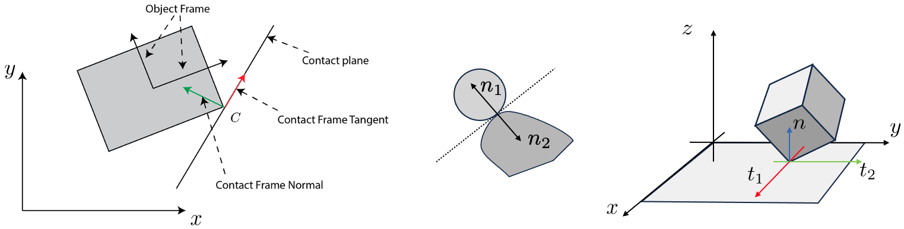

The central focus of Robotic Manipulation is the physical interaction between the robot and its environment. 
At its core, manipulation requires some form of physical contact. There are two questions every robot must answer 
when reasoning about manipulation: "what happens when I make contact with my environment?" and "how do I choose 
actions (e.g., contacts and forces) that lead to desired outcomes?". These question hint at a foundational need 
for understanding and prediction. The role of contact models is exactly to address these question, i.e. predicting 
the outcome of the physical interactions and guiding action choices. 

The field of contact modeling is too broad for our introductory discussion on robotic manipulation. Instead, 
here we'll focus on the most foundational case, that of rigid-body mechanics governed by Coulomb friction. 
Understanding this class of contact models will give you the tools to understand and master more sophisticated models. 
In this chapter, we will cover the basic mechanics using three three important manipulation problems as case studies: 
grasping, pushing, and bouncing. Before discussing these problems, we will first provide common definitions and develop 
mathematical machinery useful for our discussions. 

# Assumptions and Preliminaries

In this section, our objective is to specify the set of assumption we will use in our analyses, define some common 
terms, and develop mathematical machinery useful for our discussion on the mechanics of manipulation. For this section, 
you'll need familiarity with linear algebra. 

## Rigid-Body Mechanics

Our first major assumption is rigid-body mechanics. A rigid-body is one that undergoes no deformation at any point in 
time and space. In other words, the object does not change shape or vibrate. There are a number of interesting and 
important implications to this assumption. First, energy is not dissipated through relative particle motion (e.g., 
vibration/sound) or heat. Further, a point contact will remain a point contact. This is a relatively subtle but important 
point. Consider a compliant object such as a spatula being brought into contact with the environment. At first, the 
contact is a point or perhaps a line. As we push the spatula into the environment, it deforms, creating a contact patch. 
This deformation and change in contact formation is very complicated and the topic of current research. The rigid-body 
assumption allows us to simplify our analysis by neglecting this effect.

The rigid-body assumption is very convenient in that it allows us to represent the position of a planar body with 3 
numbers (2 for position and 1 for orientation), and 6 numbers in 3D space (more on this shortly); however, we must 
remember that it is an assumption and in practice all objects deform to some extent. Rigid-body dynamics are a 
relatively good approximation for stiff bodies that move slowly (small velocity and acceleration). Examples of these 
types of objects are surprisingly common in our day to day lives (e.g., pens, cellphones, mugs, etc.). Note that there 
are also plenty of objects that are not ``rigid'' in this sense and that scale certainly has a role to play. It is 
unlikely that 1-Dimensional objects (e.g., bristles of a brush that have only one major length factor) or 2-Dimensional 
objects (e.g., shells or sheets of paper with only two major length factors) would be well-represented as rigid-objects in general.

## Non-penetration

For most of this chapter, we will assume that no two bodies intersect each other at any point in time -- a.k.a. 
non-penetration constraint. This assumption implies that the velocity of the contact points between two objects 
cannot point towards each other. We will make extensive use of this assumption in writing constraints for contact. 
We will define distance functions to precisely quantify this notion in the Grasp Analysis subsection. We will also 
discuss methods to relax the non-penetration constraint that allows smoothing of the contact interaction. Smooth 
contact models enable a number of features including passing gradients through the contact event, smooth dynamics 
that are easier and much faster to solve, and approximations to patch contacts. However, there are also a number 
of shortcomings that we'll also discuss.

It is important to acknowledge that in the real world, verifying/detecting the non-penetration assumption is quite 
difficult due to sensor uncertainty, object geometry uncertainty, and environmental uncertainties. To address this 
limitation, advanced models and algorithms take into account these uncertainties to mitigate state-estimation and 
predictions that would lead to violation of physical constraints. These models often incorporate compliance, friction, 
and other contact-specific parameters to realistically simulate the behavior of objects during contact and to prevent 
physically implausible scenarios. We will mostly be ignoring these effects in our introductory notes.

## State and Configuration Space

State is our way of describing everything we need to know about a system to predict it's evolution over time. 
Any single rigid-body in 3D space (far from contact) has 6 degrees of freedom, 3 linear and 3 rotational, left panel 
of **Fig.below**. The state vector of this body is composed of its positions and velocities. 
The state vector can be represented using at least a 12 dimensional vector, with higher dimensional (e.g., 13D) representations 
offering a number of advantages -- more on this later. This compact representation is a very nice feature of the 
rigid-body assumption.

<figure>

  

<figcaption> <b>Fig. 1:</b> Illustrative examples of rigid-bodies and their configurations. <b>Left Panel:</b> The 
  position of a general rigid-object in 3D space (our world) can be specified using 6 numbers with respect to some 
  inertial reference frame. <b>Middle Panel:</b> The same object, now constrained to move in the 2D plane needs 
  3 degrees of freedom. The planar motion is in fact 3 constraints: out of plane motion and out of plane 
  rotations are zero too. <b>Right Panel:</b> Two link manipulator example. In general, 2 rigid-objects in the 
  plane are described by 6 numbers (3 each). However, as noted in the text, the revolute joints trims down the 
  requirement to just two numbers for relative orientations. <b>A fun aside:</b> This discussion assumes that the 
  rigid-bodies occupy Euclidean 3D space. Our current understanding is that the fabric of space-time is not Euclidean 
  and has curves. The effects of space-time curvature are negligible at the scale of manipulation tasks we consider.
</figcaption>
</figure>

If we constrain the body to the plane and force it to move along a single linear axis, we'd get a system such as the 
classical 1 dimensional mass-spring-damper system which has 2 states: position of the mass and the velocity of the mass. 
This example should provide you with the following insight: for each kinematic constraint we add, we usually remove 1 
degree of freedom which results in a reduction of the state space dimensionality by 2 (the velocity term is also removed). 
For a more complex example, consider a planar 2-link pendulum, right panel of **Fig.~\ref{fig:state-rigid-illustration}**. In 
the absence of any constraints, this system has 24 state s $(12 \times 2)$ bodies in 3D space. By constraining to the plane, 
we have removed a total of 6 degrees of freedom (1 linear and 2 rotational per object). The revolute joints between the 
ground and the first body, and the first and second body also remove 2 degrees of freedom each. In total, the constraints 
have removed 10 degrees of freedom, leaving just 2 degrees ($\theta_1, \theta_2$) resulting in a 4 dimensional state-space. 
We usually represent state with a vector of real numbers and here denote it as $\vec{s}_t \in \mathbb{R}^n$. 

Configuration space is a subset of state space that describes the positions of a system **\cite{lozano1990spatial}**. **Fig.~\ref{fig:chap1:conf}** depicts a 2D block in the world frame and its corresponding representation in configuration space. 
Configuration space is an important concept in robotics and is frequently used to describe not only the position of objects, 
but the set of admissible configurations objects are allowed to occupy. More on this later in the course.

<figure>

  

<figcaption> 
  <b>Fig. 2:</b> Visualization of state and configuration space for an object in 2D.
</figcaption>
</figure>

## Contact Frames and Planes

<figure>

  

<figcaption> 
  <b>Fig. 3:</b> Reference frames and the contact plane.
</figcaption>
</figure>

Consider the object depicted in the left pane of Fig. 3. We will refer to the reference frame 
attached to it's center of mass (COM) as the object frame. Let's assume that the object makes contact at point $C$ with 
some other object. We define the contact plane as the plane tangent to both objects, with an example shown in the middle 
pane of Fig. 3.  We define the contact frame at point $C$ with the following orthogonal axes: 

* the contact normal $\vec{n}$ is specified by the unit vector orthogonal to the contact plane -- the plane passing
  through the contact frame point tangent to the contacting bodies,
* the tangent vector $\vec{t}$ lies in the contact plane. In the 2D case, such as the one visualized in left
  pane of Fig. 3, it is convention to choose $\vec{t}$ such that its cross product into
  $\vec{n}$ points out of the plane towards us. In 3D, there are always 2 orthogonal tangent vectors and their
  choice is somewhat arbitrary, right panel of Fig. 3. It is common to choose them such that
  they either lie along the world frame coordinates or such that they simplify approximations to the contact
  friction cone (more on this later).

## Force Transmissions and the Contact Jacobian

Let's assume that a force is applied at $C$ to the object depicted in Fig. 3. In the vast 
majority of our discussion, this force will be due to contact (e.g., from a finger or the environment). Our goal 
is to map this force into the __wrench__ space of the object. For the block, we can think of the wrench space 
as the composition of the forces (linear) and torque the object would experience at the Center of Mass (COM) frame. 
While externally applied forces may or may not have torque components, the resulting object wrench is composed of 
both forces and torques in general. The motivation for mapping forces into the wrench space of the system is that 
the contribution of multiple forces can be summed up to predict the future states of the system.

We will derive the mapping between the externally applied force at $C$ to the wrench space of the object in two ways. 
The first approach will be a direct mapping using our knowledge of linear algebra. The second approach leverages 
the classical notion of Jacobians and relations between velocities. The first approach is effective for simple systems 
and for providing intuition, while the second approach generalizes much more easily and is easier to implement in code.

**Approach 1:** Let's derive an example of the contact Jacobian for Fig. 3. To start, we assume that we have applied a 
linear external force at point $C$. This force is represented in the object frame as:

$$
\vec{f}_c =  f_t \boldsymbol t + f_n \vec{n} = \begin{bmatrix} n_y \\ -n_x \end{bmatrix} f_t + \begin{bmatrix} n_x \\ n_y \end{bmatrix} f_n = 
 \begin{bmatrix} n_y & n_x \\ -n_x & n_y \end{bmatrix} \begin{bmatrix} f_t \\ f_n \end{bmatrix}
$$
 
where we write the unit normal vector in the object frame as $\vec{n} = (n_x, n_y)$ where the subscripts specify 
the projection of the vector along the object reference frame axes. Note that we have used the orthogonality of $\vec{n}$ and 
$\vec{t}$ to re-write $\vec{t}$. The first component represents the tangential force along the unit tangent vector and 
the second represents the normal force along the unit normal vector. Next, let's denote the vector pointing from the COM to 
the contact point with $\vec{r} = (r_x, r_y)$ in the object frame. To compute the effect of this force at the COM we write:

