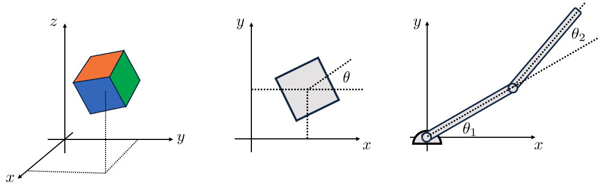

The central focus of Robotic Manipulation is the physical interaction between the robot and its environment. 
At its core, manipulation requires some form of physical contact. There are two questions every robot must answer 
when reasoning about manipulation: "what happens when I make contact with my environment?" and "how do I choose 
actions (e.g., contacts and forces) that lead to desired outcomes?". These question hint at a foundational need 
for understanding and prediction. The role of contact models is exactly to address these question, i.e. predicting 
the outcome of the physical interactions and guiding action choices. 

The field of contact modeling is too broad for our introductory discussion on robotic manipulation. Instead, 
here we'll focus on the most foundational case, that of rigid-body mechanics governed by Coulomb friction. 
Understanding this class of contact models will give you the tools to understand and master more sophisticated models. 
In this chapter, we will cover the basic mechanics using three three important manipulation problems as case studies: 
grasping, pushing, and bouncing. Before discussing these problems, we will first provide common definitions and develop 
mathematical machinery useful for our discussions. 

# Assumptions and Preliminaries

In this section, our objective is to specify the set of assumption we will use in our analyses, define some common 
terms, and develop mathematical machinery useful for our discussion on the mechanics of manipulation. For this section, 
you'll need familiarity with linear algebra. 

## Rigid-Body Mechanics

Our first major assumption is rigid-body mechanics. A rigid-body is one that undergoes no deformation at any point in 
time and space. In other words, the object does not change shape or vibrate. There are a number of interesting and 
important implications to this assumption. First, energy is not dissipated through relative particle motion (e.g., 
vibration/sound) or heat. Further, a point contact will remain a point contact. This is a relatively subtle but important 
point. Consider a compliant object such as a spatula being brought into contact with the environment. At first, the 
contact is a point or perhaps a line. As we push the spatula into the environment, it deforms, creating a contact patch. 
This deformation and change in contact formation is very complicated and the topic of current research. The rigid-body 
assumption allows us to simplify our analysis by neglecting this effect.

The rigid-body assumption is very convenient in that it allows us to represent the position of a planar body with 3 
numbers (2 for position and 1 for orientation), and 6 numbers in 3D space (more on this shortly); however, we must 
remember that it is an assumption and in practice all objects deform to some extent. Rigid-body dynamics are a 
relatively good approximation for stiff bodies that move slowly (small velocity and acceleration). Examples of these 
types of objects are surprisingly common in our day to day lives (e.g., pens, cellphones, mugs, etc.). Note that there 
are also plenty of objects that are not ``rigid'' in this sense and that scale certainly has a role to play. It is 
unlikely that 1-Dimensional objects (e.g., bristles of a brush that have only one major length factor) or 2-Dimensional 
objects (e.g., shells or sheets of paper with only two major length factors) would be well-represented as rigid-objects in general.

## Non-penetration

For most of this chapter, we will assume that no two bodies intersect each other at any point in time -- a.k.a. 
non-penetration constraint. This assumption implies that the velocity of the contact points between two objects 
cannot point towards each other. We will make extensive use of this assumption in writing constraints for contact. 
We will define distance functions to precisely quantify this notion in the Grasp Analysis subsection. We will also 
discuss methods to relax the non-penetration constraint that allows smoothing of the contact interaction. Smooth 
contact models enable a number of features including passing gradients through the contact event, smooth dynamics 
that are easier and much faster to solve, and approximations to patch contacts. However, there are also a number 
of shortcomings that we'll also discuss.

It is important to acknowledge that in the real world, verifying/detecting the non-penetration assumption is quite 
difficult due to sensor uncertainty, object geometry uncertainty, and environmental uncertainties. To address this 
limitation, advanced models and algorithms take into account these uncertainties to mitigate state-estimation and 
predictions that would lead to violation of physical constraints. These models often incorporate compliance, friction, 
and other contact-specific parameters to realistically simulate the behavior of objects during contact and to prevent 
physically implausible scenarios. We will mostly be ignoring these effects in our introductory notes.

## State and Configuration Space

State is our way of describing everything we need to know about a system to predict it's evolution over time. 
Any single rigid-body in 3D space (far from contact) has 6 degrees of freedom, 3 linear and 3 rotational, left panel 
of **Fig.below**. The state vector of this body is composed of its positions and velocities. 
The state vector can be represented using at least a 12 dimensional vector, with higher dimensional (e.g., 13D) representations 
offering a number of advantages -- more on this later. This compact representation is a very nice feature of the 
rigid-body assumption.

<figure>

  

<figcaption> <b>Fig. 1:</b> Illustrative examples of rigid-bodies and their configurations. <b>Left Panel:</b> The 
  position of a general rigid-object in 3D space (our world) can be specified using 6 numbers with respect to some 
  inertial reference frame. <b>Middle Panel:</b> The same object, now constrained to move in the 2D plane needs 
  3 degrees of freedom $(x,y,\theta)$. The planar motion is in fact 3 constraints: $(z=0)$ and that out of plane 
  rotations are zero too. <b>Right Panel:</b> Two link manipulator example. In general, 2 rigid-objects in the 
  plane are described by 6 numbers (3 each). However, as noted in the text, the revolute joints trims down the 
  requirement to just two numbers ($\theta_1, \theta_2$). <b>A fun aside:</b> This discussion assumes that the 
  rigid-bodies occupy Euclidean 3D space. Our current understanding is that the fabric of space-time is not Euclidean 
  and has curves. The effects of space-time curvature are negligible at the scale of manipulation tasks we consider.
</figcaption>
</figure>
